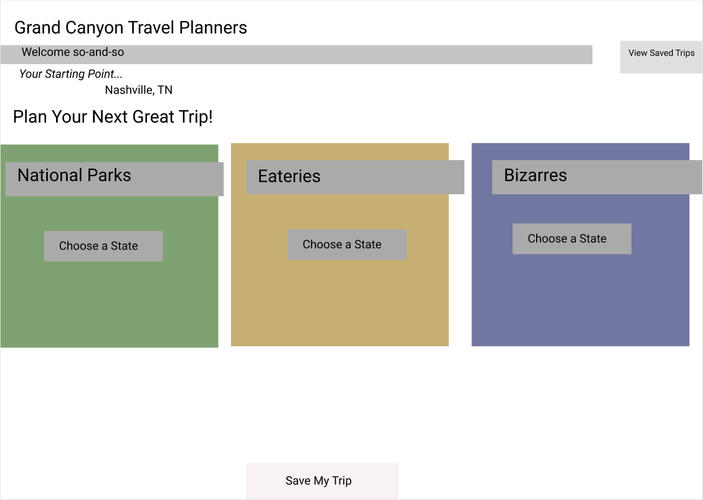
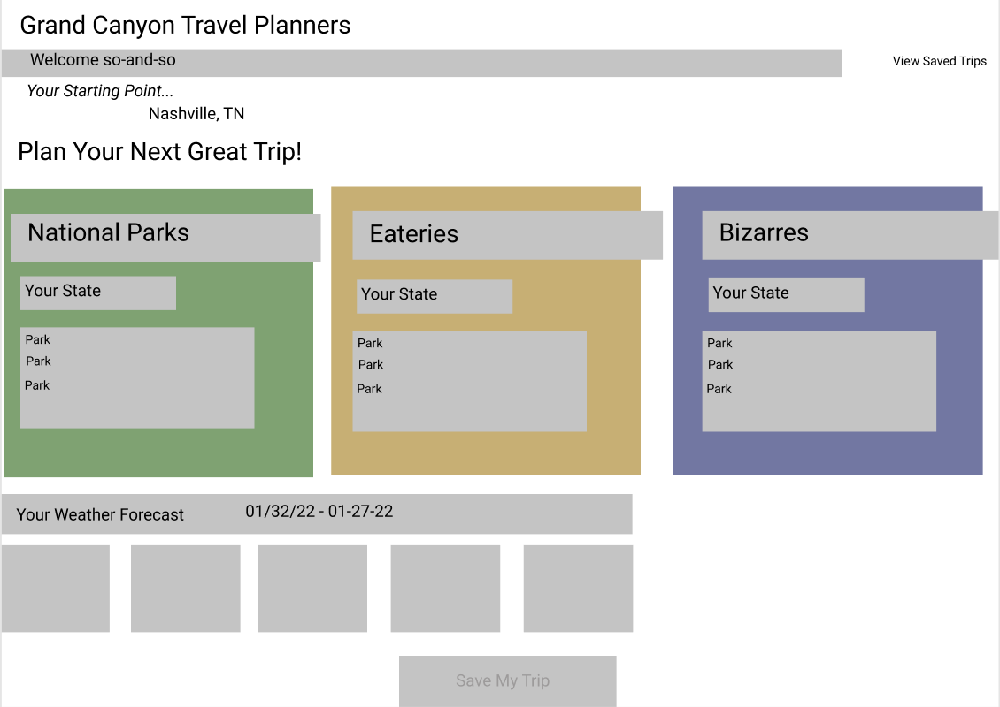
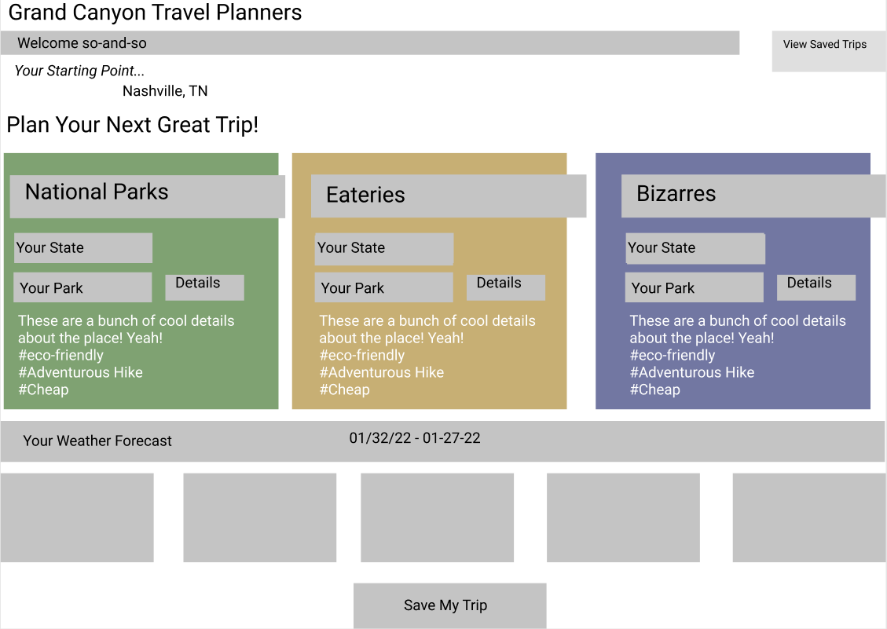
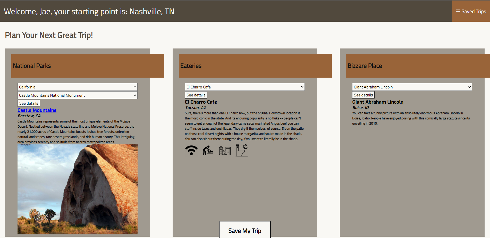
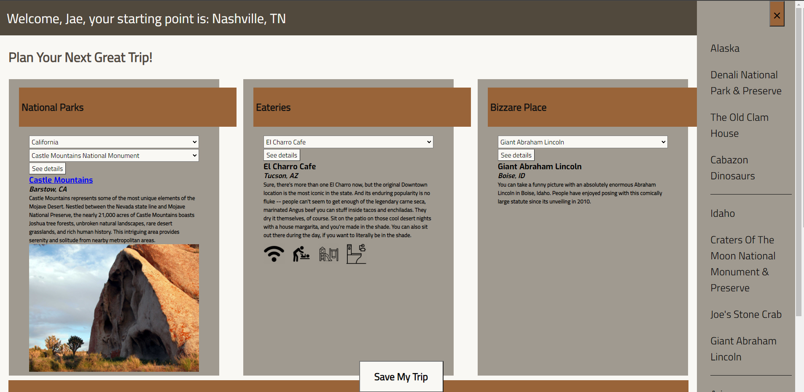
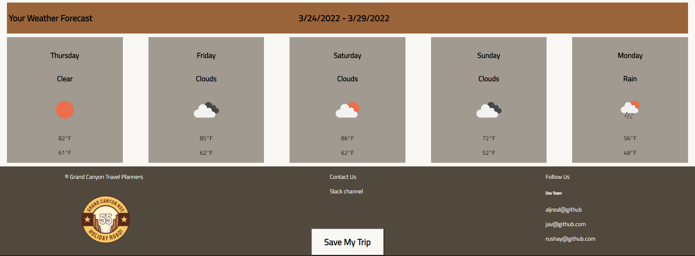

# Holiday Road Grand Canyon!
* The goal of this project was to build a web application that allows a user to create a travel plan that consists of a National Park, a bizzarary, and an eatery.
* When the user selects a state, we call on the National Parks Services API to populate a dropdown of parks, and when they select a park we use the Open Weather API to generate a 5 day weather forecast so the user can see what the weather is going to be like in the near-future at the park they choose. We also use some open APIs to populate the dropdowns for bizzararies and eateries and provide details for all three selections when prompted. Once a user has selected all three options, they can save their trip to a local database using JSON-Server, and view their saved trips in the aside bar.
* ### Tech Stack
  * <nobr></nobr> 
  

## Wireframes:
  

## ERD:

## Finished Product:

## Instructions For Viewing
1. Navigate to the directory in which you want Holiday Road to reside.
1. run `git clone https://github.com/NSS-Day-Cohort-55/holiday-road-grand-canyon.git`
1. run `cd holiday-road-grand-canyon`
1. run `serve` (npm package downloaded here https://www.npmjs.com/package/serve) to create a local server to view the website on.
2. run `json-server` (npm package downloaded here https://www.npmjs.com/package/json-server) on the db_getStarted.json in the /src/api folder. 
3. You will need to acquire an API key from OpenWeather.com and NPS and fill in those variables where needed (https://openweathermap.org/api) (https://www.nps.gov/subjects/digital/nps-data-api.htm).
4. copy & paste local port from serve command into browser.
5. This project has been closed since 3/24/2022, for help look into the API documentation.

## Contributors
1. https://github.com/JavontaeH
2. https://github.com/ActuallyAJL
3. https://github.com/rushayhays
